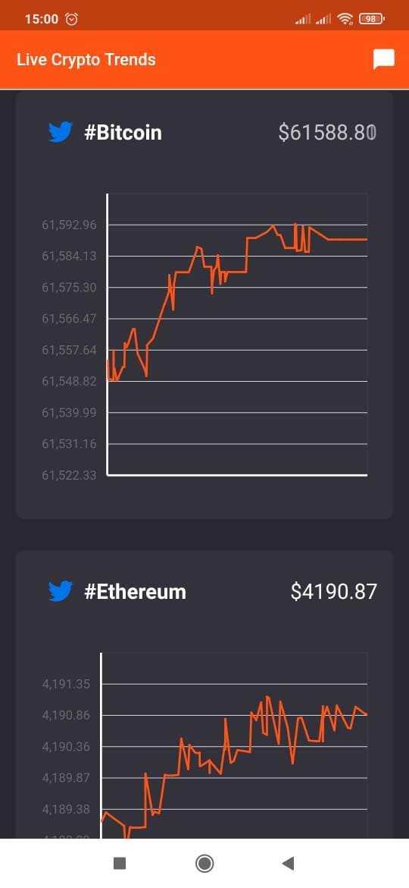
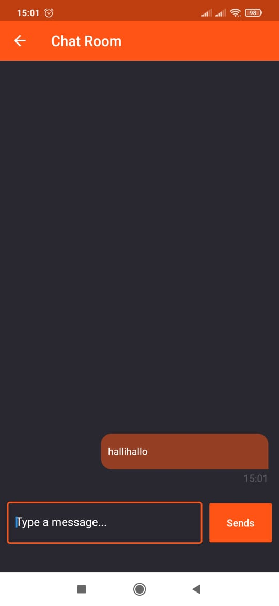

# live_crypto_trends

stay ahead on the latest live crypto trends

## Overview

Sample application to visualize cryptocurrency prices on realtime from Coindesk's cryptocurrency price data stream, powered by Ably.

## Getting Started

This project is a real example on how to use the [Ably Flutter SDK](https://pub.dev/packages/ably_flutter). To get started:
1. [Signup](https://www.ably.io) to get your Ably API Key.
2. Subscribe to [Cryptocurrency hub](https://www.ably.io/hub/ably-coindesk/crypto-pricing), note that if you didn't do this step, you won't receive data even with the API Key.
3. Sing-up for a [Twitter Developer account](https://developer.twitter.com), note that you won't be able to see any tweets if you don't have valid keys for Twitter's API.
4. Clone the project.
5. Make sure you have installed Flutter on your machine.
6. Run `flutter pub get` in the project directory.
7. Add your keys to the file [config.dart].
8. For Android, the `minSdkVersion`  in `app/src/build.gradle` has to be set to `24` as required by Ably's Flutter SDK.
9. Run the app.

For help getting started with Flutter, visit the
[online documentation](https://flutter.dev/docs), which offers tutorials,
samples, guidance on mobile development, and a full API reference.

## App Preview
  

## Want to contribute?

If you encounter any bug while using the apps in store, or running it locally, please file an issue.
  Contribution for enhancements are also welcome! just create a PR, and describe precisely what is your contribution.
